## Project schema



## Launching RedPanda  standalone

```bash
rpk container start -n 1

rpk cluster info
```

You should see the cluster infos like:


You can save the `HOST` and `PORT` to connect to the broker later.

## Ticket generation

The `ticker_generator.py` file contains the logic for the ticket generation.

Here is the format of the generated tickets:

| Column Name   | Description                                        | Example Value          |
|---------------|----------------------------------------------------|------------------------|
| `ticket_id`   | Unique identifier for the support ticket           | `"A1B2C3D4"`           |
| `client_id`   | Unique ID representing the client making the request | `"C3847"`              |
| `created_at`  | Timestamp of when the ticket was created (in UTC) | `"2025-05-18T14:23:45Z"` |
| `demande`     | The actual client request or problem description   | `"Can't access account"` |
| `type`        | Category of the request (e.g., support, billing)   | `"support"`            |
| `priorite`    | Priority level indicating urgency                  | `"urgent"`             |

## Launching pyspark script

Kafka requires spark to be launched with a package.

To get the spark version:
```bash
pyspark --version
```


To launch spark with the package for kafka:

```bash
spark-submit --packages org.apache.spark:spark-sql-kafka-0-10_2.12:3.5.5 <python-file-path>
```

Make sur `/.venv` is activated.

## Launching the app with docker

```bash
docker compose up -d
```

You can retrieve the csv and parquet files produced in the `./output` folder.

## Ressources

- Installing rpk for redpanda:

https://docs.redpanda.com/current/get-started/rpk-install/

- Redpanda tutorial:

https://medium.com/@danthelion/an-introduction-to-redpanda-creating-a-chat-application-in-python-in-less-than-100-lines-of-code-a5f375cc8e84

- kafka-python documentation:

https://kafka-python.readthedocs.io/en/master/index.html

- Apache Spark Doc - Kakfka integration guide:

https://spark.apache.org/docs/latest/structured-streaming-kafka-integration.html

- OC course on RedPanda:

https://openclassrooms.com/fr/courses/8495056-analysez-les-flux-de-donnees-en-temps-reel-avec-redpanda

- OC course on Spark:

https://openclassrooms.com/fr/courses/8493836-realisez-des-calculs-distribues-avec-spark